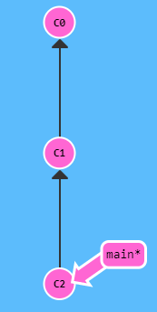

## Введение
### Что такое Git и зачем он нужен?

Git - это консольная утилита, для отслеживания и ведения истории изменения файлов, в проекте. Чаще всего его используют для кода, но можно и для других файлов. Например, для картинок - полезно для дизайнеров.    
С помощью Git-a вы можете откатить свой проект до более старой версии, сравнивать, анализировать или сливать свои изменения в репозиторий.

Репозиторием называют хранилище вашего кода и историю его изменений. Git работает локально и все ваши репозитории хранятся в определенных папках на жестком диске.

Так же ваши репозитории можно хранить и в интернете. Обычно для этого используют три сервиса:

+ GitHub

+ Bitbucket

+ GitLab

## Коммиты в GIT

Коммит в git репозитории хранит снимок всех файлов в директории. Почти как огромная копия, только лучше

Git пытается быть лёгким и быстрым насколько это только возможно, так что он не просто слепо копирует всю директорию каждый раз, а ужимает (когда это возможно) коммит в набор изменений или «дельту» между текущей версией и предыдущей.

Также Git хранит всю историю о том, когда какой коммит был сделан. Вот почему большинство коммитов имеют предков - мы указываем на предков стрелками при визуализации. Поддержка истории коммитов более чем важна для всех, кто работает над проектом!

Можно ещё долго рассказывать о коммитах, но для простоты будем считать их полными снимками проекта. Коммиты очень легки, так что переключение между ними происходит предельно быстро!

Посмотрим, как это выглядит на практике.

Изначально в репозитории два коммита: первый, исходный коммит С0 и один коммит С1 после него, содержащий изменения. После ещё одной команды git commit мы внесли изменения в репозиторий и сохранили их как коммит. У коммита, который мы только что сделали, есть родитель, С1, который указывает на предыдущий коммит.

