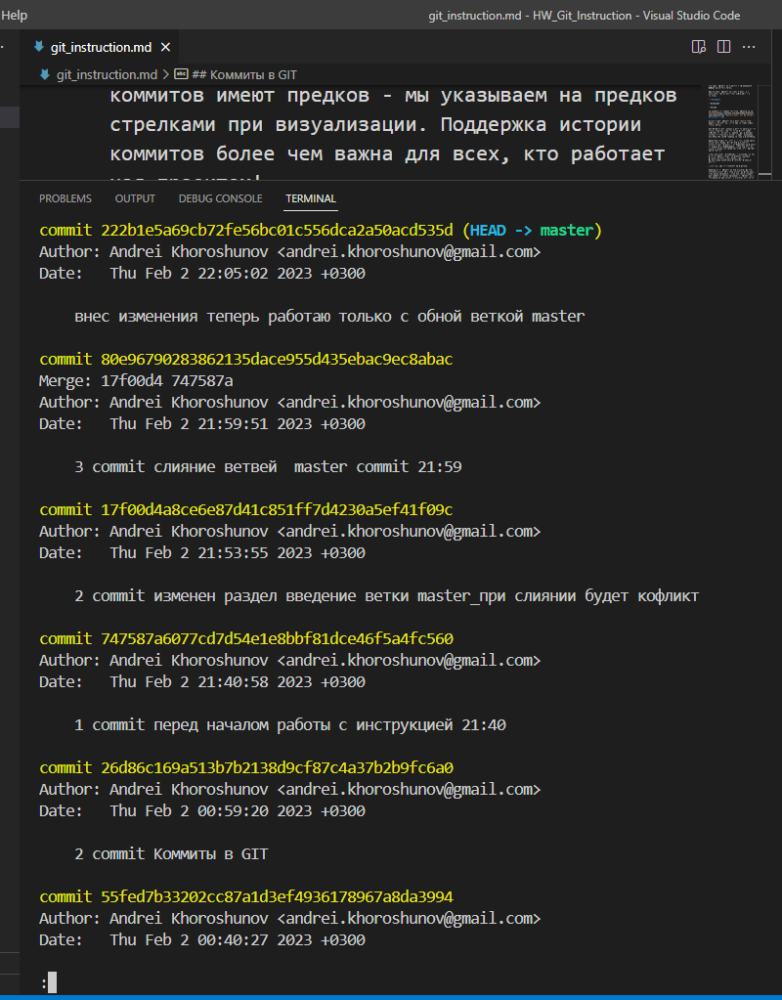

## Введение
### Что такое Git и зачем он нужен?

*Git* - это консольная утилита, для отслеживания и ведения истории изменения файлов в проекте. Чаще всего его используют для кода, но можно и для других файлов. Например, для картинок - полезно для дизайнеров.    
С помощью Git-a вы можете откатить свой проект до более старой версии, сравнивать, анализировать или сливать свои изменения в репозиторий.

*Репозиторием* называют хранилище вашего кода и историю его изменений. Git работает локально и все ваши репозитории хранятся в определенных папках на жестком диске.

Так же ваши репозитории можно хранить и в интернете. Обычно для этого используют три сервиса:

+ **GitHub**

+ Bitbucket

+ GitLab

На лекциях мы создали тестовый репозитарий на [Github](https://github.com/AndreiKhoroshunov?tab=repositories "нажмите здесь для перехода")

## Основные понятия

+ Рабочая директория — файловая система проекта (те файлы, с которыми вы работаете).

+ Индекс — список отслеживаемых git-ом файлов и директорий, промежуточное хранилище изменений (редактирование, удаление отслеживаемых файлов).

+ Директория .git/ — все данные контроля версий этого проекта (вся история разработки: коммиты, ветки, теги и пр.).

- Ветка (master, develop etc.) — указатель на коммит. При добавлении коммита, указатель ветки перемещается с родительского коммита на новый.

- Теги — простые указатели на коммиты. Не перемещаются.

## Коммиты в GIT

Коммит в git репозитории ("сохранение") хранит снимок всех файлов в директории. Почти как огромная копия, только лучше.

Git пытается быть лёгким и быстрым насколько это только возможно, так что он не просто слепо копирует всю директорию каждый раз, а ужимает (когда это возможно) коммит в набор изменений или «дельту» между текущей версией и предыдущей.

Также Git хранит всю историю о том, когда какой коммит был сделан. Вот почему большинство коммитов имеют предков - мы указываем на предков стрелками при визуализации. Поддержка истории коммитов более чем важна для всех, кто работает над проектом!

Можно ещё долго рассказывать о коммитах, но для простоты будем считать их полными снимками проекта. Коммиты очень легки, так что переключение между ними происходит предельно быстро!

Посмотрим, как это выглядит на практике.

Изначально в репозитории два коммита: первый, исходный коммит С0 и один коммит С1 после него, содержащий изменения. После ещё одной команды git commit мы внесли изменения в репозиторий и сохранили их как коммит. У коммита, который мы только что сделали C2, есть родитель, С1, который указывает на предыдущий коммит.

Ниже пример моих коммитов при составлении инструкции:

## Команды Git

| Команда | Описание |
|--------|:---|
|git init |*создать новый проект в текущей директории*|
|git status|*показать состояние репозитория (отслеживаемые, изменённые, новые файлы и пр.)*|
|git diff |*отображаются изменения и сравнивается рабочая директорию и индекс (неотслеживаемые файлы ИГНОРИРУЮТСЯ)*|
|git add . |*добавить в индекс все новые, изменённые, удалённые файлы из текущей директории и её поддиректорий*|
|git add text.txt|*добавить в индекс указанный файл (был изменён, был удалён или это новый файл)*|
|git commit -m "текст с описанием коммита"| *зафиксировать в коммите проиндексированные изменения (закоммитить), добавить описание*|
|git log -n|*показать последние "n" коммита в активной ветке*|
|git checkout xxxx|*переключиться на коммит с указанным хешем "xxxx" (переместить HEAD на указанный коммит, рабочую директорию вернуть к состоянию, на момент этого коммита)*|
|git log --all|*вызов всех коммитов независимо на ккакой ветке мы находимся*|
|git log --all --oneline| *вывод всех коммитов по одной строке на каждый*

### Команды для работы с ветками

| Команда | Описание |
|--------|:---|
|git branch| *показать список веток*|
|git branch new_branch|*создать новую ветку с указанным именем на текущем коммите*|
|git checkout new_branch |*перейти в указанную ветку*|
|git branch -v|*показать список веток и последний коммит в каждой*|
|git branch -a|*показать все имеющиеся ветки (в т.ч. на удаленных репозиториях)*|
|git branch --no-merged|*показать ветки, не слитые с активной*|
|git merge branch_name|*влить в ветку, в которой находимся, данные из ветки branch_name*|